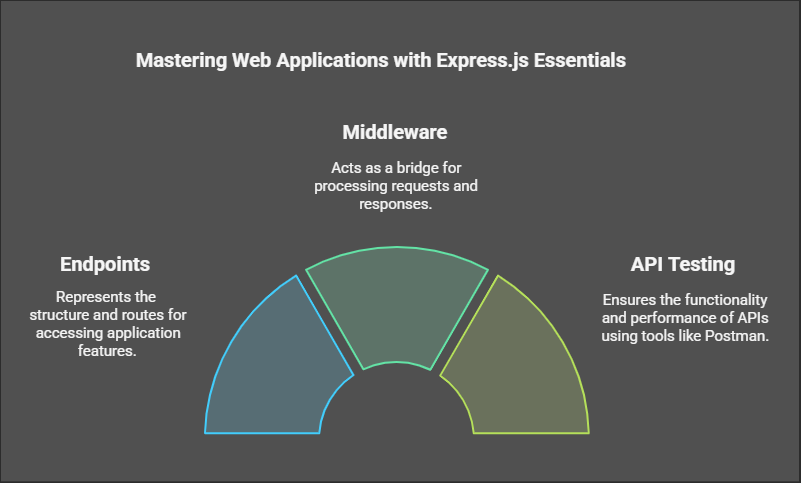
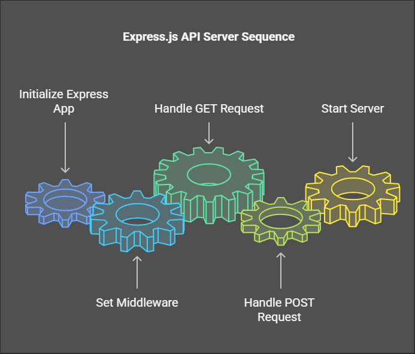

# Express.js Practice Repository


 
## Introduction
Welcome to my **Express.js** practice repository! 🚀

In this repository, I showcase all the exercises I created to learn **Express.js**, enhance my knowledge, and practice my skills. This includes various implementations of endpoints, middleware, request handling, and integrations with tools like **Postman**.


## What is Express.js?
**Express.js** is a minimal and flexible **Node.js web application framework** that provides a robust set of features to build web and mobile applications. It simplifies handling HTTP requests, routing, and middleware integration.

### Key Features of Express.js:
- Fast and lightweight
- Middleware support
- Routing capabilities
- Template engines compatibility
- REST API development

## What is Postman?
**Postman** is a popular tool used to test and interact with **APIs**. It allows developers to send HTTP requests, inspect responses, and automate API testing.

### Why Use Postman?
- Easy API testing without writing code
- Supports multiple HTTP methods (GET, POST, PUT, DELETE, etc.)
- Automates testing with collections
- Helps debug and analyze API responses

## Understanding Endpoints
An **endpoint** in a web API is a specific URL where a client sends a request to access resources on the server.

### Example Express.js Endpoints:
```javascript
const express = require('express');
const app = express();
const PORT = 3000;

// Middleware to parse JSON
app.use(express.json());

// GET request
app.get('/api/welcome', (req, res) => {
    res.send('Welcome to my Express.js API!');
});

// POST request
app.post('/api/data', (req, res) => {
    const data = req.body;
    res.json({ message: 'Data received', data });
});

// Server listening
app.listen(PORT, () => {
    console.log(`Server is running on http://localhost:${PORT}`);
});
```

## Running This Project
Follow these steps to run the project locally:

1. Clone the repository:
   ```sh
   git clone https://github.com/Yousefa7medmaher/express-practice.git
   ```
2. Navigate to the project folder:
   ```sh
   cd express-practice
   ```
3. Install dependencies:
   ```sh
   npm install
   ```
4. Start the server:
   ```sh
   node index.js
   ```
5. Open **Postman** or your browser and test the endpoints.

## Conclusion
This repository serves as a learning space for mastering **Express.js** and API development. Feel free to explore, contribute, or suggest improvements! 🚀

### Connect with Me:
- **GitHub**: [Yousefa7medmaher](https://github.com/Yousefa7medmaher)
- **LinkedIn**: [Yousef Ahmed Maher](https://www.linkedin.com/in/yousef-ahmed-maher-272275279/)
