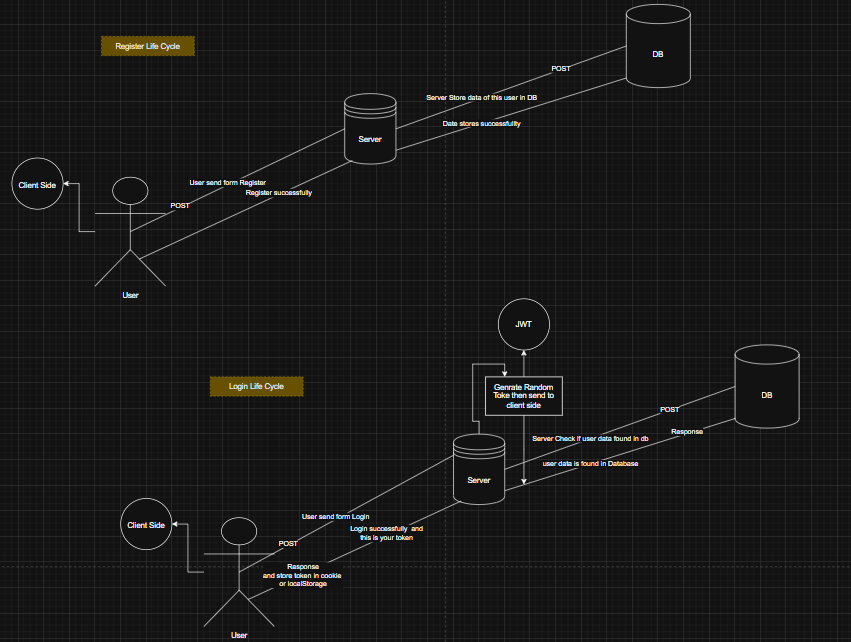

# Authentication System

This project implements user authentication with login and registration functionality using JWT for secure access control.


[To get this system Design in draw.io you can use this file ](JWT.drawio)

## Features
- User registration with email, username, phone, and password
- Secure password hashing using bcrypt
- JWT-based authentication
- Authorization for protected routes
- Admin access control
- Profile management

## Technologies Used
- Node.js
- Express.js
- MySQL
- JWT (JSON Web Token)
- bcrypt.js
- dotenv

## Database Schema
The users table consists of the following fields:
```sql
CREATE TABLE users (
    id INT AUTO_INCREMENT PRIMARY KEY,
    username VARCHAR(255) NOT NULL,
    email VARCHAR(255) NOT NULL UNIQUE,
    phone VARCHAR(20) NOT NULL UNIQUE,
    password_hash VARCHAR(255) NOT NULL,
    role ENUM('user', 'admin') DEFAULT 'user'
);
```

## API Endpoints

### User Registration
**Endpoint:** `POST /joo/ahmed/register`
- Registers a new user
- Validates email and password format
- Hashes password before storing it in the database

**Request Body:**
```json
{
    "username": "jooahmedmhaer",
    "email": "jooahmedmaheriioi@gmail.com",
    "password": "Joo01234",
    "phone": "+201092784321"
}
```

**Response:**
```json
{
    "success": true,
    "message": "User registered successfully!",
    "userId": 1
}
```

### User Login
**Endpoint:** `POST /joo/ahmed/login`
- Authenticates user and returns JWT token
- Compares password hash

**Request Body:**
```json
{
    "email": "jooahmedmaheriioi@gmail.com",
    "password": "Joo01234"
}
```

**Response:**
```json
{
    "success": true,
    "message": "Login successful",
    "token": "<JWT_TOKEN>",
    "user": {
        "id": 1,
        "email": "jooahmedmaheriioi@gmail.com",
        "role": "user"
    }
}
```

### Profile Access
**Endpoint:** `GET /joo/ahmed/profile`
- Requires authentication (JWT token)
- Returns user profile data

**Headers:**
```json
{
    "Authorization": "Bearer <JWT_TOKEN>"
}
```

**Response:**
```json
{
    "success": true,
    "message": "Profile accessed successfully",
    "user": {
        "id": 1,
        "email": "jooahmedmaheriioi@gmail.com",
        "role": "user"
    }
}
```

### Admin Access
**Endpoint:** `GET /joo/ahmed/admin`
- Requires authentication
- Requires admin role

**Headers:**
```json
{
    "Authorization": "Bearer <JWT_TOKEN>"
}
```

**Response (if user is an admin):**
```json
{
    "success": true,
    "message": "Admin accessed successfully",
    "user": {
        "id": 1,
        "email": "admin@example.com",
        "role": "admin"
    }
}
```

## Authentication & Authorization
### `auth.js`
- `authenticateToken`: Middleware to verify JWT token
- `authorizeRole(role)`: Middleware to restrict access based on user role

## How to Test
1. Start the server: `node server.js`
2. Register a user via `POST /joo/ahmed/register`
3. Login to receive a JWT token via `POST /joo/ahmed/login`
4. Use the token in Authorization header to access `/profile` or `/admin`
5. Test with Postman or any API client

## Environment Variables
Create a `.env` file with:
```
JWT_SECRET=your_secret_key
DB_HOST=your_db_host
DB_USER=your_db_user
DB_PASS=your_db_password
DB_NAME=your_db_name
```

## Contact
For support, contact: jooahmed@example.com

## License
MIT License

